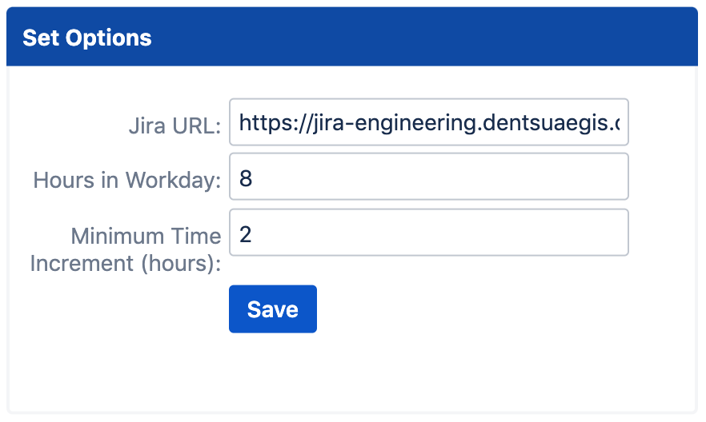

# Jira Time Logger
Log time in Jira via a simple to use Chrome extension.

# Project Aim
Reduce the time spent on administrative tasks by simplifying the process of logging time to your Jira tickets.

This extension allows you to log time across multiple tickets and days as well as allowing you to delete work log records from one place.

# Built With
- Vanilla JavaScript (ES6+)
- HTML
- CSS

# Install

The extension will soon be on the Chrome Web Store, until then it can be used by loading it as an unpacked extension in developer mode.

To load an unpacked extension:
- Open the Extension Management page by navigating to chrome://extensions. (The Extension Management page can also be opened by clicking on the Chrome menu, hovering over More Tools then selecting Extensions).
- Enable Developer Mode by clicking the toggle switch next to Developer mode.
- Click the LOAD UNPACKED button and select the **src** folder in the extension directory.

# Usage

Click on the extension icon from your browser

)

### Setting Options

On your first visit you will be directed to the extension options page to set the configuration for the extension.

)

- **`Jira URL:`** Enter the full URL of your Jira application (including http(s))
- **`Hours in Workday:`** Enter the number of hours which are classed as a working day (you will be prevented from logging more time than this value for a given day)
- **`Minimum Time Increment:`** This value controls the granularity of time that can be logged against a ticket (e.g. a value of 2 hours means that you can not log less than 2 hours to a ticket)

Click Save and your options will be stored.

To get back to the options page simply right-click on the extension icon and select Options.

### Logging Time

Once your options are set clicking on the icon will open the extension popup.

)

)

#### Video:

)

# Roadmap
- Validation on URL entered in Options page to ensure it is a valid Jira URL
- Additional time units to log work (days, minutes)
- Option to show weekends

# License
Usage is provided under the [MIT License](http://opensource.org/licenses/mit-license.php). See LICENSE for the full details.
